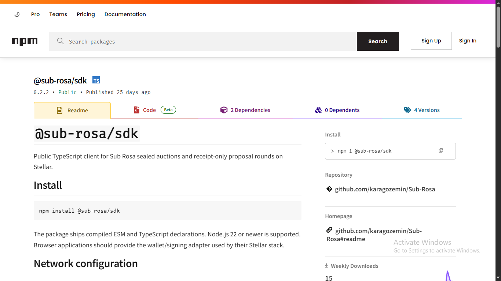
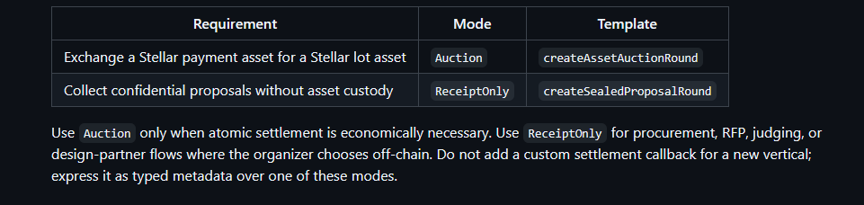
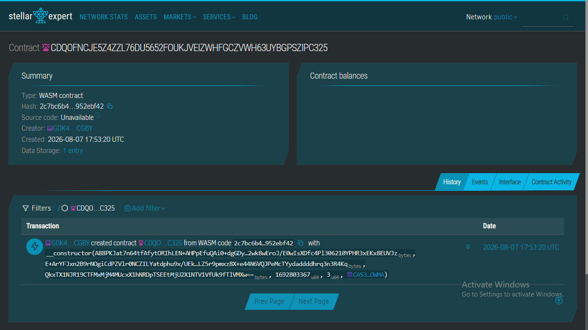

# Research: Sub Rosa

Live project page: https://usestellarwavehub.vercel.app/projects/sub-rosa-1788247664619

## Project Name

Sub Rosa

## Category

Infrastructure (DeFi-adjacent — sealed-bid coordination / auction primitives)

## Tags

soroban, sealed-bid, auctions, escrow, procurement, drand, commit-reveal, sdk

## Links

- Repo (Wave-approved): https://github.com/karagozemin/Sub-Rosa
- Site/docs: https://www.sub-rosa.online/#/docs
- npm SDK: https://www.npmjs.com/package/@sub-rosa/sdk
- Skill doc (own integration reference): https://raw.githubusercontent.com/karagozemin/Sub-Rosa/main/skills/sub-rosa/SKILL.md
- Listed in Stellar's community skills directory: https://skills.stellar.org

## Verified Stellar/Soroban identifier

**Contract ID (Stellar mainnet / "public" network):**
`CDQOFNCJE5Z4ZZL76DU5652FOUKJVEIZWHFGCZVWH63UYBGPSZIPC325`

Verified via stellar.expert:
https://stellar.expert/explorer/public/contract/CDQOFNCJE5Z4ZZL76DU5652FOUKJVEIZWHFGCZVWH63UYBGPSZIPC325

## Original description

Sub Rosa is infrastructure for running sealed, time-locked coordination
rounds on Stellar — sealed-bid auctions, confidential procurement or RFP
rounds, and similar processes where participants need to commit to a bid or
proposal privately and have it revealed only at a predetermined, publicly
verifiable moment. Rather than building an end-user marketplace, it ships as
an embeddable SDK (`@sub-rosa/sdk`) that other Stellar applications import
to run these rounds themselves.

The protocol offers two modes. `Auction` handles cases where a Stellar
payment asset is being exchanged for a Stellar-based lot asset: the lot is
custodied at round creation, bids are sealed and later revealed, and
settlement — paying the seller, transferring the lot to the winner, and
refunding losing bidders — happens atomically in one settlement call.
`ReceiptOnly` is for cases where no asset custody is needed at all, such as
confidential procurement or judging rounds, and produces a verifiable
receipt rather than moving funds.

Timing is anchored to the Drand randomness beacon (specifically its
`quicknet` network) rather than Stellar ledger numbers, so a round's reveal
window is tied to an externally verifiable, unpredictable trigger instead of
an operator-controlled clock. The lifecycle — open, reveal, clear, and (for
auctions) settle — is designed to be run permissionlessly by independent
"keepers," with retry-safe reveal calls and a grace-period void/recovery
path if a round stalls.

Notably, the project's own documentation is explicit that its "Core v2"
contracts have testnet proofs and a capped-mainnet deployment but have not
yet had an independent funds-handling audit, and instructs integrators to
keep participant and value caps in place until that happens — an unusually
candid security disclosure for a project at this stage.

## Problem it solves

Auctions, procurement rounds, and similar processes often need bids or
proposals to stay private until a fair, tamper-resistant reveal moment.
Doing this correctly on-chain (sealed commitment, externally-verifiable
timing, atomic settlement, safe recovery if something stalls) is nontrivial
to build from scratch for every app that needs it; Sub Rosa packages that
logic as a reusable primitive.

## How it uses Stellar

- Round state, commitments, and settlement logic run as a Soroban smart
  contract deployed on mainnet (see verified contract ID above).
- Auction-mode settlement moves Stellar assets (via Stellar Asset Contract/SAC)
  atomically between custody, seller, and winner in a single transaction.
- Reveal timing is derived from the Drand quicknet beacon rather than
  Stellar ledger sequence numbers, decoupling the "when" from the chain's
  own block cadence while still executing on Stellar.

## Technical approach

- SDK-first design: integrators are pointed to high-level templates
  (`createAssetAuctionRound`, `createSealedProposalRound`) rather than
  raw contract calls, with lower-level packages (`@sub-rosa/tlock`,
  `@sub-rosa/round-bindings`) available for protocol-level work.
- Strict deployment-tuple pinning (RPC URL + network passphrase + contract
  ID + expected WASM hash) with a client-side precheck before any operation,
  to prevent cross-network contract-ID mixups.
- Every wallet-signed action goes through a `preflight*V2` simulation step
  before a signature is requested, and typed errors/fee estimates are
  surfaced on failure rather than asking the user to blind-sign.
- Lifecycle is explicitly permissionless: reveals are per-participant and
  idempotent (safe to retry), a public "keeper" role advances round state,
  and there's a documented grace-period `voidV2` path for stalled rounds.
- Exports a canonical, independently-verifiable "Core v2 receipt"
  (`exportReceiptV2`/`verifyReceiptV2`) for off-chain proof of round
  outcomes, separate from raw transaction hashes.

## Team / community

Maintained under the GitHub handle `karagozemin`. No public team page,
company entity, or additional named contributors found — appears to be a
small/solo-maintainer open-source project at this stage. Listed in Stellar's
official community skills directory (skills.stellar.org) and built as part
of the "Build On Stellar Hackathon – IBW 2026" cohort, per the Drips Wave
repo listing.

## Sources

1. https://github.com/karagozemin/Sub-Rosa (repo, Wave-approval listing text)
2. https://raw.githubusercontent.com/karagozemin/Sub-Rosa/main/skills/sub-rosa/SKILL.md
   (project's own integration/security reference doc — primary technical source)
3. https://skills.stellar.org (confirms inclusion in Stellar's official
   community skills directory, with SDK feature summary)
4. https://www.npmjs.com/package/@sub-rosa/sdk (published SDK package)
5. https://www.drips.network/wave/stellar/repos (confirms Wave Program
   approval status and hackathon origin)
6. https://stellar.expert/explorer/public/contract/CDQOFNCJE5Z4ZZL76DU5652FOUKJVEIZWHFGCZVWH63UYBGPSZIPC325
   (on-chain contract verification — checked directly in-browser)

## Screenshots

### npm package page

### SKILL.md — Auction vs ReceiptOnly modes

### Verified contract on Stellar Expert

