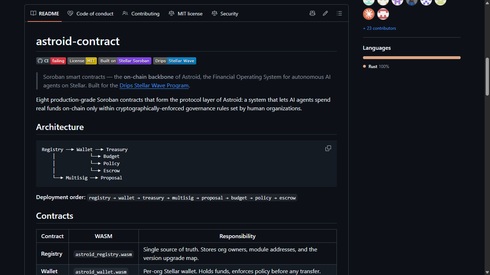
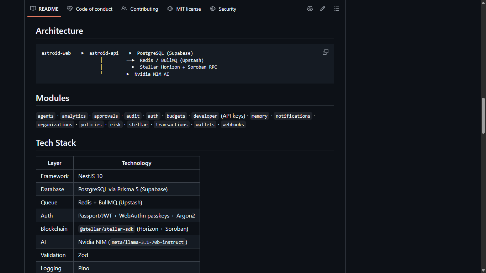
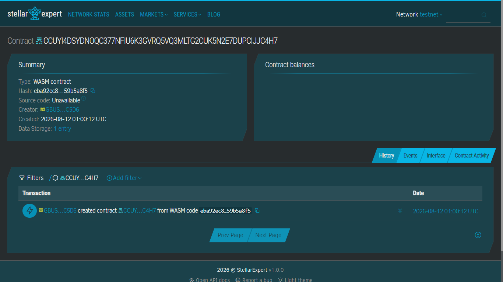

# Research: Astroid

Live project page: https://usestellarwavehub.vercel.app/projects/astroid

## Project Name
Astroid

## Category
Infrastructure / DeFi (financial governance infrastructure for autonomous AI agents)

## Tags
soroban, ai-agents, governance, treasury, multisig, budget, policy-engine, escrow

## Links
- Contracts (Wave-approved): https://github.com/ASTROIDX556/astroid-contract
- Backend: https://github.com/ASTROIDX556/astroid-api
- Frontend: https://github.com/ASTROIDX556/astroid-web
- SDK: https://github.com/ASTROIDX556/astroid-sdk

## Verified Stellar/Soroban identifier
**Deployed Registry contract (Stellar testnet):**
`CCUYI4DSYDNOQC377NFIU6K3GVRQ5VQ3MLTG2CUK5N2E7DUPCIJJC4H7`

## Original description

Astroid is infrastructure for letting autonomous AI agents spend real
money on Stellar without giving them unchecked control over funds. Rather
than building an end-user wallet app, it provides the on-chain and
off-chain plumbing that lets a human organization define exactly what an
AI agent is allowed to spend, on what, and under whose approval — then
enforces those rules cryptographically rather than by policy document.

The system is built as eight Soroban contracts. A Registry contract acts
as the single source of truth, recording which module addresses (wallet,
treasury, multisig, proposal, budget, policy, escrow) belong to which
organization, plus a version-upgrade map so modules can be swapped without
losing continuity. A per-organization Wallet contract holds funds and
checks every outgoing transfer against the organization's Policy contract
before it is allowed to execute. Treasury manages pooled assets and
allocates them out to wallets; Multisig enforces k-of-n threshold approval
for high-value transactions; Proposal implements a create → approve/reject
→ execute/cancel/expire lifecycle for spending requests that need human
sign-off; Budget tracks and caps spending per time period; and Escrow
provides time-locked or condition-based fund holding with release, refund,
or expiry paths.

Around these contracts sits a NestJS backend that exposes identity,
wallet, policy, budget, approval, and risk-scoring functionality as a
REST API, and layers an AI briefing/anomaly-detection assistant (via
Nvidia NIM) on top of the raw transaction and audit data — while keeping
the actual spending rules enforced on-chain rather than trusted to the
backend. A Next.js dashboard gives the human side of an organization
visibility and control, and a TypeScript SDK exposes the same
capabilities to other developers building agent-facing products.

## Problem it solves
Giving an autonomous AI agent a funded wallet is straightforward; giving
it a funded wallet that can't be drained by a bug, a prompt injection, or
a runaway loop is not. Astroid's premise is that agent spending needs the
same kind of governance a company applies to a corporate card — budgets,
approval thresholds, multisig for large amounts, revocable policy — except
enforced by a smart contract an agent literally cannot bypass, rather than
by trusting the agent (or its operator's backend) to behave.

## How it uses Stellar
- All governance state and enforcement logic lives in Soroban contracts:
  Registry, Wallet, Treasury, Multisig, Proposal, Budget, Policy, and
  Escrow, deployed in that dependency order.
- The Wallet contract checks every transfer against the Policy contract
  before funds move, so spending limits are enforced at the contract
  level rather than trusted to the calling application.
- The backend integrates with Stellar via Horizon and Soroban RPC
  (`@stellar/stellar-sdk`), with a fully-featured mock mode so the rest of
  the system can be developed without a live on-chain dependency.

## Technical approach
- Contracts: Rust (edition 2021) on `soroban-sdk` 21.7.7, built for
  `wasm32v1-none` via the Stellar CLI; workspace split into
  `contracts/` (the eight modules), `interfaces/` (shared contract
  interface traits), and `shared/` (shared types, errors, constants,
  validation) so contracts can call each other against stable interfaces.
- Backend: a NestJS "modular monolith" — 16 self-contained domain modules
  (agents, wallets, policies, budgets, approvals, risk, stellar,
  transactions, analytics, etc.), Zod-validated input, a uniform response
  envelope, and typed domain events over a shared event bus.
- Async work (transaction execution, risk analysis, webhook delivery,
  notifications) runs through BullMQ workers backed by Redis.
- Auth: JWT access/refresh plus WebAuthn passkey support and Argon2
  password hashing; role guards and per-tier rate limiting.
- Data layer: PostgreSQL via Prisma, with 17 modeled entities spanning
  organizations, agents, wallets, policies, budgets, transactions,
  proposals, approvals, audit logs, and API keys/webhooks for third-party
  integration.
- The contracts repo explicitly documents itself as **unaudited,
  testnet-only** pending a professional security audit — a security
  disclosure worth noting rather than omitting.

## Team / community
Maintained under the GitHub organization `ASTROIDX556`. The `astroid-api`
repo names an individual maintainer, "joshua chekube," alongside the org
account; `astroid-contract` lists the org account as "Astroid Team"
without further named individuals. All four repos show real, ongoing
contributor activity consistent with active Wave Program participation
(32-47 forks per repo, open issues and pull requests, commits as recent as
the last day at time of research) rather than a single-sprint hackathon
submission.

## Sources
1. https://github.com/ASTROIDX556/astroid-contract (canonical contracts
   repo — architecture, contract responsibilities, deployment section
   containing the verified testnet Registry contract ID, security
   disclosure)
2. https://github.com/ASTROIDX556/astroid-api (canonical backend repo —
   architecture diagram, module list, tech stack, API endpoint table,
   named maintainer)
3. https://github.com/ASTROIDX556 (org page — confirms four active
   repositories, fork/issue/PR counts, recent commit activity)
4. https://www.drips.network/wave/stellar/orgs (confirms ASTROIDX556 as an
   approved organization in the Stellar Wave Program, 4 approved repos)

## Screenshots

### `astroid-contract` README architecture diagram

### `astroid-api` architecture diagram

### Verified contract on Stellar Expert

