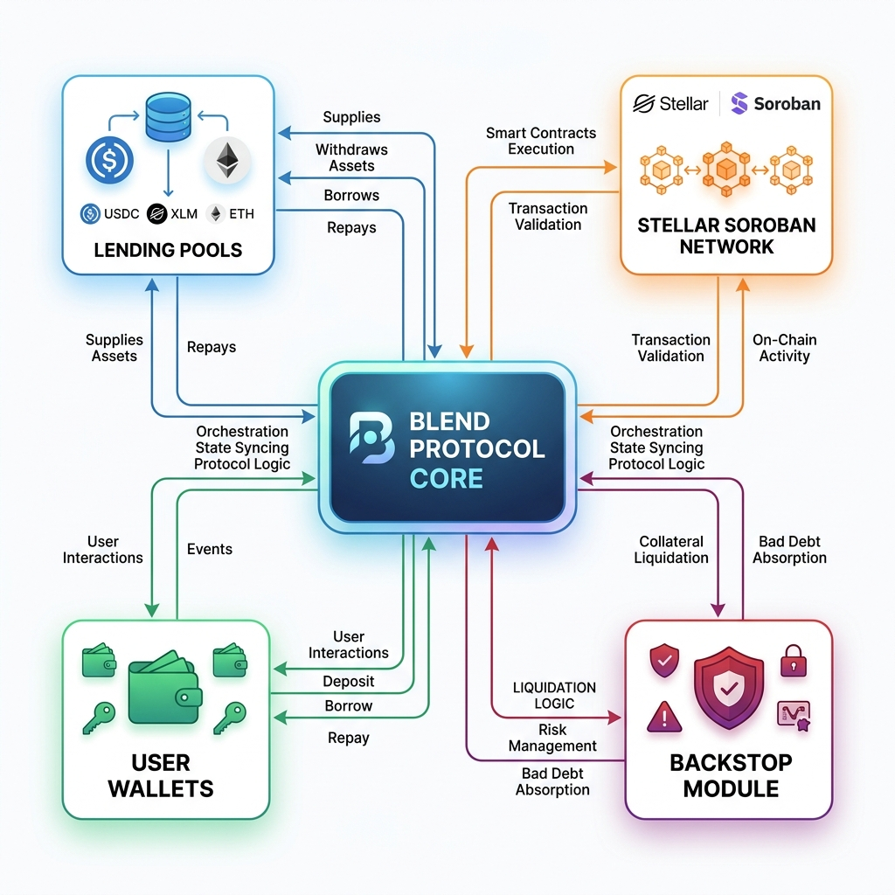

# Blend Protocol - Stellar Wave Program Submission

## Project Name
Blend Protocol

## Description
Blend Protocol is a decentralized finance (DeFi) liquidity and lending protocol built natively on the Stellar network using Soroban smart contracts. Developed by Script3, it serves as a robust foundational primitive for decentralized lending and borrowing on Stellar. Blend distinguishes itself by enabling permissionless deployment of customizable lending pools. This means anyone—from individual users to DAOs and financial institutions—can create lending markets tailored to their specific needs. 

The protocol utilizes an algorithmic interest rate model that reactively adjusts to market conditions, maximizing capital efficiency without requiring constant manual governance. A key feature of Blend is its isolated risk architecture: each lending pool is entirely separate, ensuring that users are only exposed to the risks of the specific pool they interact with, rather than systemic risk across the entire protocol. Furthermore, Blend incorporates a mandatory "backstop module" for each pool. This module acts as an insurance fund, absorbing bad debt and protecting lenders from losses during volatile market conditions. By leveraging Soroban, Blend delivers a scalable, trust-minimized, and censorship-resistant lending solution that bridges the gap between traditional finance (Real-World Assets) and decentralized finance on the Stellar network.

## The Problem the Project Solves
Traditional lending platforms and many early DeFi lending protocols often use a single monolithic liquidity pool, which creates systemic risk—if one asset fails or gets exploited, the entire protocol's liquidity is at risk. Furthermore, launching new lending markets typically requires lengthy DAO governance processes. Blend solves these issues by offering permissionless, isolated lending pools. This isolation protects users from systemic contagion, while the permissionless nature allows rapid deployment of new markets, including specialized markets for Real-World Assets (RWAs) or new ecosystem tokens, without centralized bottlenecks.

## How the Project Uses Stellar
Blend is built entirely on Stellar’s Soroban smart contract platform. It leverages Stellar's low transaction fees, fast settlement times, and built-in compliance capabilities to offer a highly efficient DeFi experience. By utilizing Soroban, Blend achieves true decentralization and trustless execution for its lending, borrowing, and liquidation mechanics, positioning itself as a core liquidity layer for the growing Stellar DeFi ecosystem.

## Technical Approach
Blend utilizes a modular smart contract architecture on Soroban. The core components include:
*   **Pool Factory:** Enables the permissionless creation of new, isolated lending pools.
*   **Lending Pools:** Individual smart contracts managing the supply and borrowing of specific asset pairs, utilizing a reactive interest rate model.
*   **Backstop Module:** A specialized insurance contract attached to pools that incentivizes users to deposit funds to act as a buffer against bad debt.
*   **Oracle Integration:** Uses Soroban-compatible oracles to fetch real-time price feeds for accurate collateral valuation and liquidations.

## Team and Community Information
Blend was developed by **Script3**, a well-known development team within the Stellar ecosystem dedicated to building advanced DeFi primitives. The protocol has an active community of developers and DeFi enthusiasts, supported by the broader Stellar Development Foundation (SDF) through initiatives like the Stellar Community Fund.

## Verified Soroban Contract IDs
*   **Blend Token Contract:** `CD25MNVTZDL4Y3XBCPCJXGXATV5WUHHOWMYFF4YBEGU5FCPGMYTVG5JY`
*   **Emitter Smart Contract:** `CCOQM6S7ICIUWA225O5PSJWUBEMXGFSSW2PQFO6FP4DQEKMS5DASRGRR`
*   **Backstop Smart Contract:** `CAQQR5SWBXKIGZKPBZDH3KM5GQ5GUTPKB7JAFCINLZBC5WXPJKRG3IM7`
*   **Pool Factory Smart Contract:** `CDSYOAVXFY7SM5S64IZPPPYB4GVGGLMQVFREPSQQEZVIWXX5R23G4QSU`

## Category and Tags
**Category:** DeFi / Lending
**Tags:** `DeFi`, `Lending`, `Borrowing`, `Soroban`, `Smart Contracts`, `Liquidity`

## Supporting Screenshots

