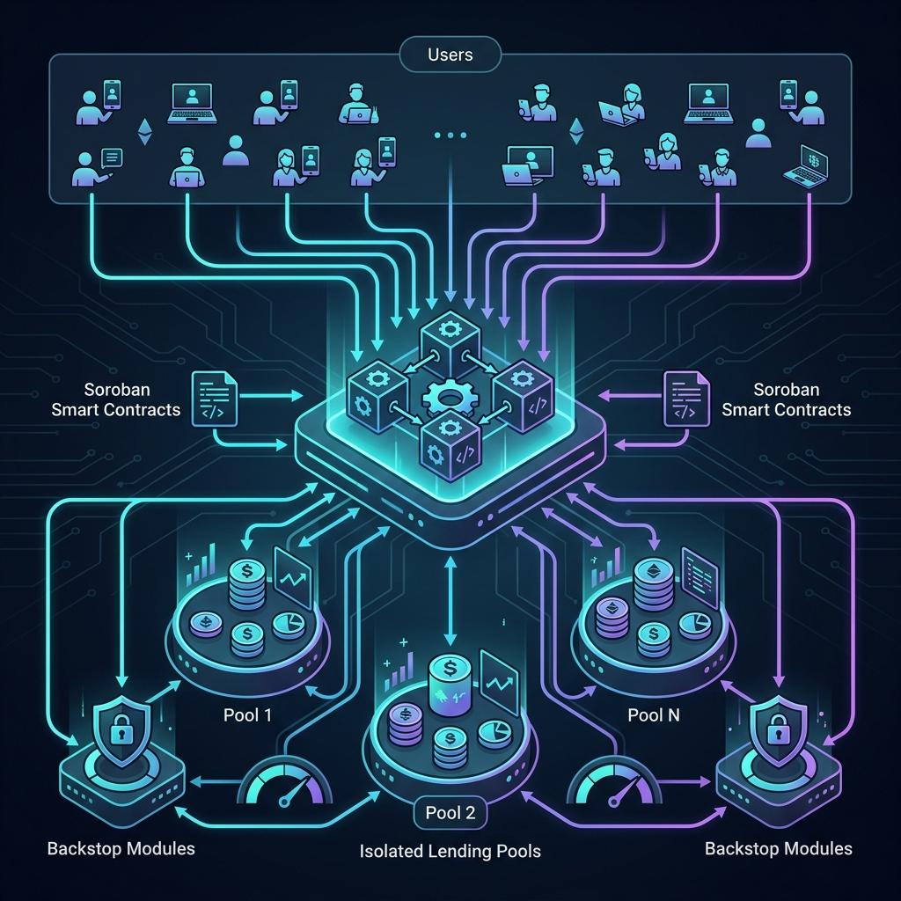

# Blend Protocol - Stellar Wave Research Submission

## Project Selected

- **Project:** Blend Protocol
- **Wave source:** Decentralized, non-custodial lending protocol on Stellar
- **Domain:** DeFi (Decentralized Finance)
- **Category:** DeFi / Lending

## Description: The Problem It Solves

Blend Protocol is designed to address the need for decentralized, efficient, and customizable lending markets within the Stellar ecosystem. Historically, the Stellar network lacked native, permissionless primitives for lending and borrowing, which meant users had to rely on centralized intermediaries or navigate fragmented platforms to utilize their capital effectively. 

Specifically, Blend solves the problem of "slack capital" (idle assets) by implementing a reactive interest rate mechanism that ensures capital is utilized efficiently. It also solves the problem of fragmented liquidity by providing a flexible foundation for creating isolated lending pools. This allows for diverse collateral types, including real-world assets (RWAs), without requiring users to hop across disparate protocols. Blend empowers users to create highly customizable pools to support various financial products ranging from institutional lending to yield farming, fundamentally enhancing capital efficiency on the Stellar network.

## Technical Approach and Stellar Integration

Blend operates as a set of immutable, non-custodial smart contracts built on **Soroban**, Stellar's smart contract platform. The technical architecture relies on three core primitives:

### 1. Isolated Lending Pools
Unlike traditional monolithic lending protocols, Blend's lending pools are isolated from one another. This design ensures that lenders and borrowers are exposed only to the risk of the specific pool they participate in, preventing systemic risk from cascading across the entire protocol.

### 2. Backstop Modules
Every lending pool in the Blend ecosystem is paired with a "backstop module." This functions as a form of mandatory insurance. If a pool accrues bad debt or suffers losses, the funds in the backstop module are liquidated to protect the suppliers, ensuring the solvency of individual pools.

### 3. Permissionless Deployment
Blend allows anyone to deploy a new lending pool without central approval, provided they can bootstrap enough liquidity into the corresponding backstop module. This permissionless mechanism fosters innovation while relying on economic incentives to maintain safety. Pool creators have full control over parameters such as supported assets, collateral requirements, and the selected pricing oracle.

## Verifiable On-Chain Information

**Stellar Network:** Mainnet
**Smart Contract Platform:** Soroban (Rust / WASM)
**Verified Soroban Contract ID:** `CD25MNVTZDL4Y3XBCPCJXGXATV5WUHHOWMYFF4YBEGU5FCPGMYTVG5JY`

## Team and Community

Blend Protocol is developed by **Script3**, a team dedicated to building foundational DeFi primitives for the Stellar network. Co-founded by developers like Markus, the team prioritizes mass-market adoption and "real-world" financial utility, bringing sophisticated yet accessible decentralized finance tools to Stellar users globally.

## Category and Tags

**Primary Category:** DeFi
**Tags:** defi, lending, soroban, smart-contracts, backstop, stellar, borrowing

## Supporting Architecture

Below is a conceptual architecture diagram illustrating the interaction between users, isolated lending pools, backstop modules, and the underlying Soroban smart contracts.

## Submission Details

- **Submitted to:** Stellar Wave Hub
- **Status:** Research Phase
- **Verification:** Mainnet Soroban contract ID verified; architecture researched through protocol documentation and public repositories.
