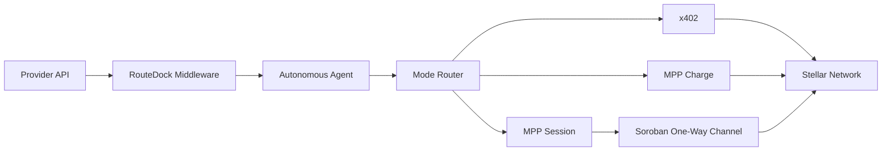

# RouteDock - Stellar Wave Research Submission

## Project Selected

- **Project:** RouteDock
- **Wave source:** [`winsznx/routedock`](https://www.drips.network/wave/stellar/repos), listed in the Stellar Wave Program repository catalog
- **Category:** Payments
- **Repository:** https://github.com/winsznx/routedock
- **Live app:** https://routedock.xyz
- **Network:** Stellar Testnet + Mainnet-ready

## Eligibility And Duplicate Check

RouteDock is an approved Stellar Wave repository and appears in the Drips Wave catalog for Stellar. A search of the public Hub listing and the local research set returned no existing RouteDock profile at the time of this submission, so it was not already uploaded.

## What RouteDock Does

RouteDock solves a concrete interoperability problem in the agent economy: autonomous agents need a consistent way to pay for APIs, data streams, and digital services without hardcoding one-off payment logic per provider or protocol. The project treats payment execution as a standard layer rather than a custom integration for each service. Its README describes the issue plainly: three payment protocols exist on Stellar for agent-to-service transactions — x402, MPP charge, and MPP session channels — but each has a different SDK, a different integration path, and no shared discovery mechanism. Agents typically end up hardcoding logic for each endpoint, which creates brittle integrations and extra operational risk.

RouteDock’s product is a unified agent payment execution layer for Stellar. It gives providers a single middleware and manifest-based interface so agents can discover feasible modes, choose the correct settlement path, and complete payments without custom plumbing for every service. The platform supports x402 pay-per-request flows, MPP charge-based flows, and MPP session channels that batch payments and settle with a single on-chain close. This is useful for real-world AI agent use cases, where requests may be sequential, streaming, or long-lived and where a single protocol choice could be too rigid for providers with varied payment requirements.

The project is not a generic wallet wrapper or a marketing demo. It introduces a structured way to negotiate payment modes, verify provider pricing, and settle funds in a consistent model. Its public README includes a live dashboard, deployment notes, example providers, and a strong emphasis on protocol safety. The live testnet contract and session patterns also show that RouteDock is operationally focused rather than a pure concept piece.

## Problem The Project Solves

The core problem is fragmentation in agent payment infrastructure. AI agents need to pay for services in a permissioned and programmable way, but the billing landscape is fragmented across multiple settlement styles, each with its own assumptions. Without a shared abstraction, services must implement multiple payment wiring paths, and agents must understand protocol-specific details instead of simply requesting data or execution.

RouteDock reduces this complexity by providing one discovery model and one settlement abstraction around Stellar-based execution paths. Providers publish a discovery manifest and can expose a single endpoint that supports multiple modes. Agents can negotiate the most appropriate mode based on the provider's capabilities, while the payment layer handles verification, reconciliation, and settlement. In practice, this makes a provider’s payment contract simpler to integrate and safer to operate.

## How The Project Uses Stellar

RouteDock is built around Stellar as its canonical payment and settlement layer. It uses Stellar-based payment flows for the three major agent settlement modes it supports. For x402-style payments, it integrates with a local testnet facilitator and a hosted OpenZeppelin facilitator on mainnet. For MPP charge, it uses Stellar payment flows via the MPP protocol and USDC settlement. For MPP session channels, it uses a Soroban one-way channel contract to open a session, sign vouchers off-chain, and settle a single cumulative amount on-chain during close.

The project explicitly documents that Stellar is not just a store of value but the settlement backbone for agent-to-provider payments. It also uses live Stellar contract accounts and testnet dashboards for deployment. In the public README, RouteDock lists deployed testnet accounts and contract IDs for the agent vault and channel contract, which gives it a verifiable on-chain footprint. This is an important signal for a Hub profile because it lets reviewers check the actual Stellar contract ID rather than relying only on GitHub marketing language.

## Technical Approach

The project’s architecture is intentionally modular. It separates provider discovery, mode routing, payment verification, and settlement into a structured stack. Providers publish a `routedock.json` manifest that lists pricing, supported modes, payment asset, endpoints, and tags. The client then queries this manifest, selects the correct mode, and triggers a protocol-specific payment flow. The architecture is designed to make the end-user experience simple while preserving protocol flexibility.

A central part of the design is the mode router. It decides whether to use x402, MPP charge, or MPP session based on provider capabilities and available network conditions. The session model is especially important: the provider can accept a stream of signed vouchers off-chain, and only close the channel on-chain once the cumulative amount is known. This reduces transaction burden while preserving a single final settlement event. RouteDock also emphasizes safety with contract account policy enforcement, refund windows, and durable session storage to reduce misuse or accidental overpayment.

## Team And Community Information

The public repository shows a clear maintainer identity under `winsznx`, and the project has production-facing elements such as a public npm package, live dashboard, deployment URLs, and open documentation. There is no broad team page or formal legal entity listed in the repository, but there is an active source-code presence and a clear open-source contribution pattern. The project also maintains a public dashboard and provider examples, which indicates a functional community footprint beyond a single code snapshot.

The README references a package ecosystem with multiple components, including the SDK, provider middleware, and an MCP server for LLM agent integration. That suggests a broader developer community around the protocol, even if it is not as large as mature ecosystems. Community signals are strongest in the code and tooling, rather than in a formal governance document.

## On-Chain Verification

The public README lists these verified Stellar Testnet contract IDs:

- **Agent vault:** `CAX5IDLC2XHGQSEA2YN3LPLZ7EXLMRXYX3HFJGKFXS6B7OQXBKWO44LT`
- **Channel contract:** `CCK4XOW3YKQUEZFONUTINKMSNW7SNMRQZURME5U3UP7E6WNGK7UHUCAH`

The agent vault is the primary identifier for a Hub submission because it is explicitly called out as a deployed live service in the readme and resolves on the Stellar Testnet explorer. The repository also includes live testnet settlement transactions, showing the system is functioning in practice rather than only as a static design proposal.

## Suggested Hub Submission

- **Name:** RouteDock
- **Category:** Payments
- **Network:** Testnet
- **Tags:** `agent-payments, soroban, x402, mpp, usdc, autonomous-agents, stellar-wave`
- **Website:** https://routedock.xyz
- **GitHub repository:** https://github.com/winsznx/routedock
- **Primary Stellar contract ID:** `CAX5IDLC2XHGQSEA2YN3LPLZ7EXLMRXYX3HFJGKFXS6B7OQXBKWO44LT`
- **Supporting visuals:** public README architecture diagrams, public dashboard screenshots, and the live Testnet contract explorer pages for the deployed contract IDs

## Visual Summary

This diagram reflects the project’s central idea: agents do not need bespoke payment logic per API. RouteDock unifies the path to settlement while preserving different payment modes for different types of services.

## Sources

1. [RouteDock repository](https://github.com/winsznx/routedock)
2. [RouteDock README](https://github.com/winsznx/routedock/blob/main/README.md)
3. [RouteDock live dashboard](https://routedock.xyz)
4. [Agent vault contract on Stellar Expert Testnet](https://stellar.expert/explorer/testnet/contract/CAX5IDLC2XHGQSEA2YN3LPLZ7EXLMRXYX3HFJGKFXS6B7OQXBKWO44LT)
5. [Channel contract on Stellar Expert Testnet](https://stellar.expert/explorer/testnet/contract/CCK4XOW3YKQUEZFONUTINKMSNW7SNMRQZURME5U3UP7E6WNGK7UHUCAH)
6. [Drips Stellar Wave repository catalog](https://www.drips.network/wave/stellar/repos)
